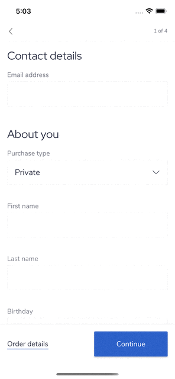

# react-native-keyboard-tools
> Typesafe way to work with keyboard


[](https://www.npmjs.com/package/react-native-keyboard-tools)
[](https://www.npmjs.com/package/react-native-keyboard-tools)
<!-- [](https://github.com/faradey27/react-native-keyboard-tools/releases) -->
[](https://github.com/faradey27/react-native-keyboard-tools/issues)
[](https://github.com/faradey27/react-native-keyboard-tools/issues?q=is%3Aissue+is%3Aclosed)

-----

## Table of contents

  - [Showcase](#showcase)
  - [Usage](#usage)
    - [KeyboardAwareScrollView](#keyboardawarescrollview)
    - [useMaskedTextInput](#usemaskedtextinput)
    - [KeyboardAwareScrollView and useMaskedTextInput](#keyboardawarescrollview-and-usemaskedtextinput)
  - [KeyboardAwareScrollView props and methods](#keyboardawarescrollview-props-and-methods)
    - [Props](#props)
    - [Methods](#methods)
  - [useMaskedTextInput params](#usemaskedtextinput-params)
  - [Credits](#credits)
  - [License](#license)
  - [Author](#author)

-----

## Showcase



[Expo Playground](https://snack.expo.io/@andriitiertyshnyi/blessed-donuts)

-----

## Usage

```bash
$ npm install --save react-native-keyboard-tools
```

or

```bash
$ yarn add react-native-keyboard-tools
```

### KeyboardAwareScrollView

```jsx
import { View, TextInput } from 'react-native'
import { KeyboardAwareScrollView } from 'react-native-keyboard-tools'

export const MyComponent = () => {
  return (
    <KeyboardAwareScrollView>
      <View>
        <TextInput />
      </View>
      <View>
        <TextInput />
      </View>
      <View>
        <TextInput />
      </View>
    </KeyboardAwareScrollView>
  )
}
```

### useMaskedTextInput

```jsx
import { useState } from 'react'
import { View, TextInput } from 'react-native'
import { useMaskedTextInput } from 'react-native-keyboard-tools'

export const MyComponent = () => {
  const [value, setValue] = useState("");
  const { onChangeMaskedText } = useMaskedTextInput({ mask: "+3(99) 9999 9999", onChangeText: setValue });

  return <TextInput onChangeText={onChangeMaskedText} />
}
```

### KeyboardAwareScrollView and useMaskedTextInput

```jsx
import { View, TextInput } from 'react-native'
import { KeyboardAwareScrollView, useMaskedTextInput } from 'react-native-keyboard-tools'

export const MyComponent = () => {
  const [value, setValue] = useState("");
  const { onChangeMaskedText } = useMaskedTextInput({ mask: "+3(99) 9999 9999", onChangeText: setValue });

  return (
    <KeyboardAwareScrollView>
      <View>
        <TextInput />
      </View>
      <View>
        <TextInput />
      </View>
      <View>
        <TextInput onChangeText={onChangeMaskedText} />
      </View>
    </KeyboardAwareScrollView>
  )
}
```

-----

## KeyboardAwareScrollView props and methods

### Props

Prop | Description | Type | Default
------ | ------ | ------ | ------
**`children`** | Any react node | ReactNode | **Required**
**`automaticallyAdjustContentInsets`** | Controls whether OS should automatically adjust the content inset for scroll views that are placed behind a navigation bar or tab bar/toolbar. | Boolean | false
**`restoreScrollOnKeyboardHide`** | Controls whether library should restore scroll position to the initial value after keyboard become hidden | Boolean | false

Any react-native ScrollView props are also accepted([ScrollViewProps](https://reactnative.dev/docs/scrollview#props))

### Methods

```jsx
import { View, TextInput } from 'react-native'
import { KeyboardAwareScrollView, KeyboardAwareScrollViewRef } from 'react-native-keyboard-tools'

export const MyComponent = () => {
  const scrollViewRef = useRef<KeyboardAwareScrollViewRef>();

  return (
    <KeyboardAwareScrollView ref={scrollViewRef}>
      <View>
        <TextInput />
      </View>
      <View>
        <TextInput />
      </View>
      <View>
        <TextInput onChangeText={onChangeMaskedText} />
      </View>
    </KeyboardAwareScrollView>
  )
}
```

scrollViewRef.scrollTo: `({ x, y, animated }: { x?: number; y?: number; animated?: boolean }) => void`

-----

## useMaskedTextInput params

```js
const { onChangeMaskedText } = useMaskedTextInput({ mask, onChangeText });
```

mask: `defined by pattern`

* `9` - accept digit.
* `A` - accept alpha.
* `S` - accept alphanumeric.
* `*` - accept all, EXCEPT white space.

Example: `AAA-9999` 

onChangeText: `(value: string) => void`

onChangeMaskedText: `(value: string, rawValue: string) => void`

-----

## Credits

Inspired by https://github.com/wix/react-native-keyboard-aware-scrollview and https://github.com/benhurott/react-native-masked-text

## License

[MIT.](LICENSE.md)

## Author

[Andrii Tiertyshnyi](https://www.linkedin.com/in/atiertyshnyi/)
